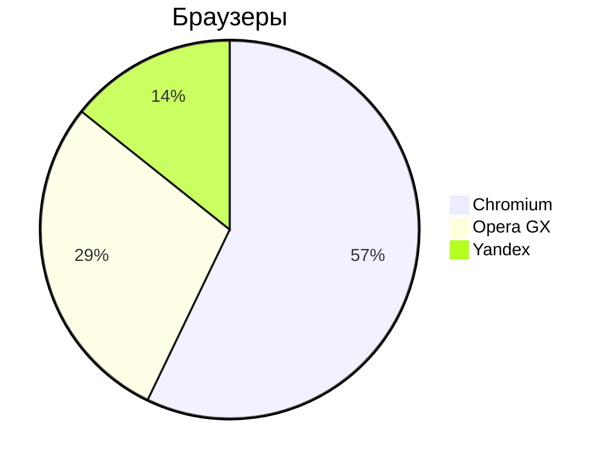

## Markdown

**Markdown** - это облегчённый язык разметки текст, удобней `HTML`

### Заголовки

# Заголовок 1 уровня
## Залоловок 2 уровня
### Залоловок 3 уровня
#### Залоловок 4 уровня
##### Залоловок 5 уровня

### Text

* **жирный текст** 
* *курсив*
* ~~Зачеркнутый текст~~ четыре тильды `~`
* <u>Подчёркнутый тест</u>

### Списки

#### Ненумерованный список

* Пункт 1
* Пункт 2 
* Пункт 3
    * Пункт 3.1
    * Пункт 3.2
    * Пункт 3.4

- Пункт 1
- Пункт 2 
- Пункт 3
    - Пункт 3.1
    - Пункт 3.2
    - Пункт 3.4

#### Нумерованный список

1. Пункт 1
2. Пункт 2
3. Пункт 3

***

1. Пункт 1
1. Пункт 2
1. Пункт 3
    1. Пункт 1
    1. Пункт 2
    1. Пункт 3

### Цитаты

> Важный текст

> Очень важный текст
> касаемый
> программирования

### Код

```cpp
#include <iostream>
int main() {
    puts("Привет!");
    return 0;
}
```
```python
print("Привет!")
```


